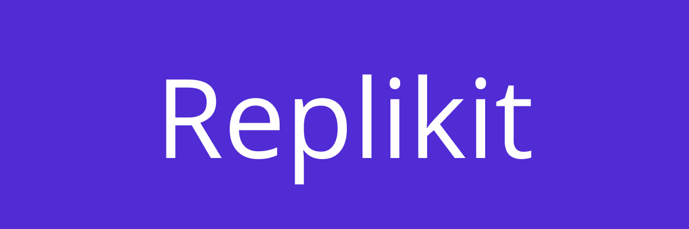

    
    <h6>
        
        
        
    </h6>

---

A modern modular platform for building chat bots and virtual assistants by following the software development best
practices and conventions. A powerful set of abstractions that allows you to create applications independent of specific
messengers and social networks.

### Documentation

- [Getting started](docs/getting-started.md)
- [Core overview](src/core/README.md)
- [Extensions](src/extensions/README.md)
- [Supported platforms](src/adapters/README.md)

### Contributing

Pull requests are welcome. For major changes, please open an issue first to discuss what you would like to change.

Please make sure to update tests as appropriate.

### License

[MIT](https://choosealicense.com/licenses/mit/)
